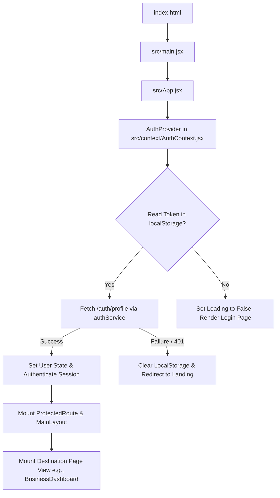

# 📚 CLIKS-FE-BUS: Technical Handover & Architectural Deep-Dive

Welcome to the **CLIKS-FE-BUS** (Books & Finance Platform) frontend documentation. This guide was prepared by the Senior Tech Lead to serve as your single source of truth. As a new developer, this document will guide you through the entire project ecosystem—assuming **zero prior knowledge**. 

Our engineering culture prioritizes **clarity, modular design, clean state ownership, and bulletproof security**. Let's dive in!

---

# 1. Project Overview

### What is this Project?
**CLIKS-FE-BUS** is a high-performance, enterprise-ready Single Page Application (SPA) built on React and Vite. It serves as the primary client dashboard and administrative hub for modern business record management, automated invoice preparation, tax calculations, customer support operations, and corporate CA-level compliance monitoring.

### Purpose of the Application
The application provides a comprehensive suite of financial ledger tools, inventory tracking, HR management, real-time analytics, and client-accountant collaboration workspaces. It bridges the gap between raw day-to-day operations and high-level financial planning, making it an indispensable tool for business owner workflows.

### Business Goal
*   **Operational Efficiency:** Standardize business accounting processes (billing, expenses, payroll, and stock management) in one unified interface.
*   **Audit Readiness:** Implement pre-emptive compliance checks and standard frameworks (IFRS and US GAAP) so businesses are always audit-ready.
*   **Real-time Collaboration:** Enable standard business users, sales agents, support agents, and chartered accountants (CAs) to operate under isolated, role-specific portals within the same unified environment.

### Main Features
1.  **Finance & Business Dashboard:** Bento-grid workspace visualizing live financial parameters, budget margins, and account balances.
2.  **Billing & Invoicing Engine:** Renders and processes customized Retail and GST-compliant invoices with automatic breakdowns of CGST, SGST, IGST, and Input Tax Credit (ITC) limits.
3.  **Smart CA Auditor Hub:** Enables compliance scanning, comparative GAAP inspections, corporate resolution lists, and contact annotations.
4.  **Warehouse & Inventory Tracking:** Controls multi-godown asset movements, stock replenishment signals, barcode/QR generation, and custom category tags.
5.  **Multi-Role Portal Routing:** Isolated portal structures for Sales Representatives (lead trackers), Support Agents (helpdesk tickets), and Administrators (system moderation and audit trails).

### End Users
*   **Business Owners / Operators:** Manage billing, inventory, staffing, and cash flow.
*   **Chartered Accountants (CAs) / Auditors:** Review transactions, run compliance diagnostics, and verify general ledger integrity.
*   **Sales Agents:** Follow up with potential prospects and log marketing outcomes.
*   **Support Agents:** Track, moderate, and resolve customer support tickets.
*   **System Administrators:** Supervise user behaviors, moderate system feeds, and audit logs.

### Problem this Product Solves
Traditional enterprise resource planning (ERP) systems are notoriously rigid, slow, and expensive. Smaller and medium-sized organizations often struggle with fragmented tools—using separate applications for inventory, invoicing, employee attendance, and accountant interaction. **CLIKS-FE-BUS** consolidates these disjointed tools into a highly interactive, fast, and secure frontend experience.

---

# 2. Tech Stack Used

| Technology | What it is | Why it is used | Where it is used in the Project |
| :--- | :--- | :--- | :--- |
| **React 19.2.0** | Frontend Component Framework | Powers the declarative UI view layer via functional components and hooks. | Entire `/src` directory |
| **Vite 7.2.4** | Modern Build Tool & Dev Server | Offers instant Hot Module Replacement (HMR) and optimized Rollup production bundling. | Root level config files (`vite.config.js`) |
| **React Router DOM 7.12.0** | Client-Side Router | Drives Single Page Application (SPA) path navigation and role-based route guards. | `src/App.jsx`, `src/routes/ProtectedRoute.jsx` |
| **TanStack Query v5** | Server-State Management | Caches, invalidates, and synchronizes server data without global state overhead. | Services layer and components (e.g., `src/pages/BusinessCA.jsx`) |
| **Framer Motion 12.29.0** | Animation Library | Creates hardware-accelerated transitions, modal fades, and sliding layout panels. | `src/layouts/MainLayout.jsx`, side overlays |
| **Tailwind Merge & Clsx** | Utility Class Merging | Safely merges and compiles custom HSL CSS styling utilities without collisions. | `src/lib/utils.js` |
| **Lucide React** | Modern Icon Set | Provides clean, scalable SVG icons throughout the dashboard. | Component-wide icon definitions |
| **XLSX (SheetJS)** | Spreadsheet Processing | Processes excel formatting exports for invoices and ledgers. | Billing templates and transaction summaries |
| **React Barcode & QRCode.react** | Utility Generators | Dynamically prints visual barcode bands and QR pixel grids for invoices. | `src/pages/BusinessBarcode.jsx` |

---

# 3. Complete Folder Structure Analysis

Below is the recursive directory analysis of the `/src` folder, defining responsibilities, purposes, and consumer dependencies.

```text
src/
├── api/                  # Low-level network fetch layer and error normalization
├── assets/               # Static image assets, logos, and vector shapes
├── components/           # Presentation primitives, modals, sidebars, and templates
│   ├── common/           # Shared components (Error boundaries, generic page loaders)
│   ├── dashboard/        # Bento-grid widgets, transaction summaries, analytics
│   └── ui/               # Lower-level presentation blocks (buttons, accordions, inputs)
├── context/              # Session token lifecycles and global auth states
├── layouts/              # Viewport wrappers (Main Layout boundaries and sidebars)
├── lib/                  # Central configurations, clients, and layout utils
├── pages/                # Page views mounted directly by the router paths
│   ├── admin/            # Administrative pages (moderation, audits, sales controls)
│   ├── salesAgent/       # Sales representative dashboard and prospect tracker
│   └── support/          # Helpdesk portals and ticket processing pages
├── routes/               # Navigation safety layers and role-authorization checks
├── services/             # Endpoint definitions, payload processing, and service client hooks
├── styles/               # Styling sheets, layout spacing, themes, and animations
├── test/                 # Test suites, mock servers, and query setups
└── utils/                # Helper algorithms, calculators, formats, and exports
```

### Folder Responsibilities

*   **`src/api/`**: Coordinates low-level API queries, fetch configuration clients, and error normalizations. No component must ever trigger `fetch` directly; they consume methods from `/services`, which use `/api` to transit requests.
*   **`src/components/`**: Modular presentation primitives, calculators, sidebars, and overlays. Divided into `/common` (reusable helpers), `/dashboard` (dashboard widgets), and `/ui` (raw elements like Accordions).
*   **`src/context/`**: Declares React Context environments. Specifically, `AuthContext.jsx` manages user profiles, login routines (SSO, Admin, Support), impersonation tokens, and session termination.
*   **`src/layouts/`**: Dynamic wrappers providing structure and viewport boundaries. `MainLayout.jsx` orchestrates responsive menus, global sidebar states, header elements, sliding audits, and announcement banners.
*   **`src/lib/`**: Hosts framework setup scripts. Includes environment config validations (`config.js`) and the shared TanStack `queryClient` instantiation.
*   **`src/pages/`**: View panels loaded by routes inside `App.jsx`. Feature subdirectories organize isolated views for `admin/`, `salesAgent/`, and `support/`.
*   **`src/routes/`**: Secures client routing paths. Consists of `ProtectedRoute.jsx` which enforces session presence and checks roles before letting requests proceed.
*   **`src/services/`**: The standard business logic layer of the application. Contains 40+ isolated service modules (e.g. `caService.js`, `billingService.js`) matching backend routes.
*   **`src/styles/`**: Custom styling rules. CSS rules are loaded via HSL variables in `index.css` and animation keyframes in `App.css`.
*   **`src/utils/`**: Helper methods. House formatting logic, table filters, date formats, and tax calculations.

---

# 4. Entry Flow of Application

Understanding how the application initializes is essential for debugging boot failures:



### Step-by-Step Initialization Chain:

1.  **HTML Entry Point:** The browser opens `index.html`, which contains a root `<div id="root">` element and calls `<script type="module" src="/src/main.jsx"></script>`.
2.  **Gateway Bootloader (`src/main.jsx`):** Renders the React root element inside the DOM. It loads global styling classes (`src/index.css`), wraps the tree in `React.StrictMode`, and loads `src/App.jsx`.
3.  **Global Routing Structure (`src/App.jsx`):** Wraps the application in `QueryClientProvider` (supplying TanStack Query server-state tools) and the unified `AuthProvider` context. It then maps out Public and Protected routing paths.
4.  **Authentication Inspection (`src/context/AuthContext.jsx`):** Reads the client's memory for `books_auth_token` in `localStorage`.
    *   **Case A: Token Exists:** Sets initial loading state to `true` and triggers `authService.getProfile()`. Upon resolution, the user state is populated and loading concludes.
    *   **Case B: Token is Missing:** Instantly shuts down the loading cycle, leaving the user state as `null`.
5.  **Route Guard Interception (`src/routes/ProtectedRoute.jsx`):** For protected layouts:
    *   If `isAuthenticated` is `false`, it redirects the client to the landing page `/auth` (preserving `location.pathname` inside the navigation history to redirect back after login).
    *   If the route specifies an authorized role requirement (e.g., `role="admin"`) and the authenticated profile lacks it, the guard redirects them to `/dashboard`.
6.  **Shell Layout Loading (`src/layouts/MainLayout.jsx`):** Renders the navigation boundary including sidebars, responsive top headers, and alert banners.
7.  **Server State Caching & Render:** The viewport renders the target child component (e.g. `/ca` leads to `BusinessCA.jsx`), which triggers queries to fetch fresh dashboard data.

---

# 5. Routing Flow

All application routing is declared and routed from `src/App.jsx`. The application separates paths into public landing gates and secure protected workspaces.

### Route Mapping Grid

| Route Path | Component Mounted | Route Gate | Allowed Roles | Purpose |
| :--- | :--- | :--- | :--- | :--- |
| `/` | `Landing` | Public | All | Explains value proposition and displays login buttons. |
| `/auth` | `Auth` | Public | All | Sign-in and registration pages for standard tenant modules. |
| `/verify-pass` | `VerifyPass` | Public | All | Verification interface for quick agent entries. |
| `/admin/login` | `AdminLogin` | Public | All | High-security gateway for platform admins. |
| `/sales/login` | `SalesLogin` | Public | All | Gateway for marketing representatives. |
| `/support/login` | `SupportLogin` | Public | All | Helpdesk representative access panel. |
| `/dashboard` | `BusinessDashboard` | Protected | `'business'` | Primary bento-grid tracking panel. |
| `/ca` | `BusinessCA` | Protected | `'business'` | Tabbed accountant workflow and compliance auditor portal. |
| `/sales/invoice` | `BusinessBilling` | Protected | `'business'` | Invoice creator, retail/GST print, and item generator. |
| `/inventory/products`| `BusinessInventory` | Protected | `'business'` | Product SKU ledger with quantities and category lists. |
| `/finance/gst` | `BusinessGST` | Protected | `'business'` | Prepares and validates CGST, SGST, IGST tax estimates. |
| `/admin/dashboard` | `AdminDashboard` | Protected | `'admin'` | Global statistics, system health, and user metrics. |
| `/admin/logs` | `AdminAuditLogs` | Protected | `'admin'` | Immutable activity log history. |
| `/sales-portal/leads`| `SalesLeads` | Protected | `'sales_agent'` | Track, rate, and modify incoming business leads. |
| `/support-portal/db` | `SupportDashboard` | Protected | `'support_agent'`| Helpdesk panel for moderate actions. |

*Note: The sidebar component highlights paths dynamically by reading the router's active location via `useLocation().pathname`.*

---

# 6. Component Architecture

The codebase separates interface components into three structured tiers:

```text
src/components/
├── common/             # Layout boundaries & error wrappers
├── ui/                 # Atomic design primitives
└── dashboard/          # Feature-level panels & widgets
```

### Shared Component Definitions

#### 1. Core UI Elements (`src/components/ui/`)
These are highly optimized, reusable presentation primitives:
*   **`Accordion`:** Uses framer-motion animations to expand and collapse FAQs.
*   **`FilterableTableHead`:** Standardizes sort parameters and search filtering over tabular datasets (used extensively in inventory lists, supplier registers, and audit log pages).

#### 2. Layout Framework Components (`src/components/`)
*   **`Sidebar.jsx`:** Left sidebar navigation panel. Highlights active segments and handles responsive mobile drawer toggles. It reads permissions from the active user's role.
*   **`Topbar.jsx`:** Horizontal header managing notification indicators, screen zoom levels, network latency status, and the Profile settings dropdown.
*   **`AuditPanel.jsx`:** A sliding overlay drawer that renders the user's audit trails dynamically.
*   **`BroadcastBanner.jsx`:** Renders globally broadcasted admin messages at the very top of the layout.

#### 3. Feature-Scoped Modules
*   **`InvoiceTemplates.jsx`:** Pre-configured print-ready invoice formats (Retail, GST, thermal) that convert raw billing inputs into beautiful PDF exports.
*   **`SettingsCustomizer.jsx`:** Allows users to adjust theme variables, toggle feature toggles, and modify system preferences.

---

# 7. State Management Flow

The application manages state using a clear separation between **Server Cache** and **Transient UI state**:

```text
               ┌──────────────────────────────────────────────────┐
               │              Global Session Storage              │
               │  AuthContext.jsx manages tokens, user logs, etc. │
               └────────────────────────┬─────────────────────────┘
                                        │ (Checks credentials)
                                        ▼
               ┌──────────────────────────────────────────────────┐
               │             Server-State Cache (async)           │
               │   TanStack Query (v5) caches backend API calls   │
               └────────────────────────┬─────────────────────────┘
                                        │ (Reads active keys)
                                        ▼
               ┌──────────────────────────────────────────────────┐
               │             Transient Component State            │
               │  useState manages active tabs, filters, scanners │
               └──────────────────────────────────────────────────┘
```

### State Division Matrix

1.  **Global Server Cache (TanStack Query):** Caches server data using structured Query Keys (e.g. `['caExpenses']` or `['inventoryProducts']`). This state is managed by TanStack Query, which handles refetching and caching behind the scenes.
2.  **Global Session State (React Context):** Renders the user session, current roles, and auth tokens through `AuthContext.jsx`. Changes to this state trigger layout updates.
3.  **Local Component State (`useState`):** Manages simple, temporary values like active tab indices, sidebar open/close flags, modal toggles, and filter inputs.

---

# 8. API Architecture

The frontend uses a structured, two-layer pattern for all API integration:
1.  **Transport Client (`src/api/client.js`):** A custom fetch wrapper that automatically handles authentication headers, request timeouts, and error normalization.
2.  **Isolated Services (`src/services/`):** Page-specific service files that define exact endpoints and handle data mapping (e.g., `caService.js`, `billingService.js`).

### Core Network Transit Flow

```text
Component (calls hook / service)
   ├── 1. Service triggers endpoint (e.g. getComplianceScan)
   ├── 2. ApiClient constructs absolute URL and injects Authorization: Bearer token
   ├── 3. AbortController starts a 30-second timeout guard
   ├── 4. Request is sent to backend server
   ├── 5. Response is normalized by errors.js (resolves text/JSON or returns a structured ApiError)
   └── 6. Query Client resolves cache and updates the UI
```

### Core API Endpoint Directory

Below are the key endpoints mapped to their services and frontend consumers:

| Service File | Endpoint Target | Method | Purpose | Request Body | Response Payload | Consumed In |
| :--- | :--- | :--- | :--- | :--- | :--- | :--- |
| `authService.js` | `/auth/sso-login` | `POST` | Exchanges SSO tokens for JWT access tokens. | `{ token, appType }` | `{ success, accessToken, user }` | `AuthContext.jsx` |
| `authService.js` | `/auth/profile` | `GET` | Fetches the active user's session profile. | `None` | `{ success, user }` | `AuthContext.jsx` |
| `caService.js` | `/ca/expenses` | `GET` | Fetches expense items for CA compliance scanning. | `None` | `{ success, data: [...] }` | `BusinessCA.jsx` |
| `caService.js` | `/ca/scan` | `POST` | Runs the rule-based compliance scanner. | `{ standard }` | `{ success, scanSummary }` | `BusinessCA.jsx` |
| `billingService.js` | `/invoices` | `POST` | Saves new billing entries. | `{ invoiceBody }` | `{ success, invoice }` | `BusinessBilling.jsx` |
| `productsService.js`| `/inventory/products`| `GET` | Fetches active inventory inventory items. | `None` | `{ success, products: [...] }` | `BusinessInventory.jsx` |
| `adminService.js` | `/admin/impersonate`| `POST` | Lets admins impersonate user accounts for support. | `{ userId }` | `{ success, accessToken, user }` | `AuthContext.jsx` |

---

# 9. Authentication & Authorization

The system enforces strict client-side guards and user role restrictions.

### Step-by-Step Login & Guard Sequence:

```text
Step 1: User logs in (SSO, Admin, or Agent gateway)
   │
   ▼
Step 2: Access Token is written to localStorage ('books_auth_token')
   │
   ▼
Step 3: AuthProvider initializes session and sets user role
   │
   ▼
Step 4: Router intercepts requests and validates role permissions
   ├── Role = 'business'  ──> Mounts Business Modules (Invoicing, CA, GST)
   ├── Role = 'admin'     ──> Mounts Moderation, Audit logs, and Sales Team manager
   └── Role = 'support'   ──> Mounts Helpdesk dashboard and FAQ panel
```

### Impersonation Security Protocol
When an administrator impersonates a business user via `impersonateLogin(userId)`:
1.  The frontend calls `adminService.impersonateUser(userId)`.
2.  It receives the impersonated access token.
3.  **Critical Security Step:** The `AuthContext` calls `queryClient.clear()` to immediately purge the administrative data from the cache before loading the impersonated session. This prevents data leaks.

---

# 10. Environment Variables

The application relies on `.env` configuration variables for operation. The entry variables are parsed and validated inside `src/lib/config.js`.

### Environment Configuration Schema

```env
# ── API Base Endpoint URL
# Points to the active Express server routing directory
VITE_API_BASE_URL=http://localhost:8000/api/v1

# ── Development Tools Toggle
# Set to true to show the local developer helper overlays
VITE_ENABLE_DEV_TOOLS=true

# ── Dynamic Observability Key
# Sentry endpoint for logging errors and performance telemetry
VITE_SENTRY_DSN=https://abc12345@o9999.ingest.sentry.io/45000

# ── Active Environment Flag
# Tracks if this is development, staging, or production
VITE_APP_ENV=development

# ── WebSockets Server URL
# Channels realtime updates for notifications and broadcasts
VITE_SOCKET_URL=ws://localhost:8000/ws
```

> [!CAUTION]
> **Production Security Rules:**
> 1. Never commit `.env` files to git.
> 2. Ensure mock token bypass logic (`'mock-test-token'`) is only active in development modes.

---

# 11. Styling Architecture

Our styling system uses a hybrid approach combining **modern utility classes** with a structured **Vanilla CSS design system**.

### Styling Structure
*   **`src/index.css`:** Defines our core styling tokens (color palettes, margins, layouts) using standard CSS HSL variables. This acts as our global design system.
*   **`src/App.css`:** Contains custom layouts, dashboard configurations, and hardware-accelerated Framer Motion animations.
*   **`src/styles/`**: Custom style sheets containing page-specific styles.

### Premium HSL Color Palette (Aesthetics Blueprint)
We avoid harsh, generic primaries. Instead, we use a sleek, high-contrast dark theme built on harmonious HSL color values:

```css
:root {
  --background: 224 71% 4%;      /* Deep space dark background */
  --foreground: 213 31% 91%;     /* Crisp blue-white foreground text */
  --card: 224 71% 4%;            /* Sleek card base color */
  --primary: 263.4 70% 50.4%;    /* Vivid royal violet highlight */
  --accent: 216 34% 17%;         /* Muted blue-gray for borders and secondary elements */
  --border: 216 34% 17%;
  --muted: 215.4 16.3% 56.9%;    /* Clean gray for secondary labels */
}
```

---

# 12. Reusable Utilities

Common utility helpers reside in `src/utils/` and are consumed globally:

*   **`formatters.js`:** Standardizes date displays, currencies, and decimal parameters.
*   **`excelExport.js`:** Wraps XLSX methods to convert JSON records into formatted spreadsheets.
*   **`calculations.js`:** Core math engine for computing invoice sub-totals, discounts, CGST, SGST, IGST values, and rounding margins.
*   **`hooks/`:** Contains custom React hooks (e.g., `useComplianceScanner` and `useNotificationService`) that extract state logic away from page layout files.

---

# 13. Forms & Validation

Ensuring reliable data entry is key to avoiding database errors.

*   **Form Management:** The codebase uses standard React state-controlled components for maximum control and simplicity.
*   **Validation Rules:** Inputs are validated before submission using a two-tier approach:
    1.  **Client-Side Checks:** Interactive UI checks that highlight missing fields, invalid GSTIN prefixes, or incorrect amounts before sending requests.
    2.  **API Verification Layer:** Structured backend validation schemas (using Express Validator and Zod) that catch and reject invalid data.

---

# 14. Data Flow Diagram

Understanding the journey of a user action is key to debugging state updates:

```text
[User Action: Click "Create Invoice"]
       │
       ▼
[Page Component: BusinessBilling.jsx] ──> Validates input & calls mutation hook
       │
       ▼
[Service Hook: billingService.createInvoice] ──> Transits payload to API client
       │
       ▼
[API Endpoint: POST /api/v1/invoices] ──> Backend validates and writes to DB
       │
       ▼
[API Client returns success response]
       │
       ▼
[Mutation Trigger: queryClient.invalidateQueries] ──> Purges stale invoice cache
       │
       ▼
[React Query refetches data & UI updates]
```

---

# 15. Feature-by-Feature Explanation

Below is an overview of our key business features:

### 1. Invoicing & Billing Module
*   **Purpose:** Allows users to create, preview, and print invoices.
*   **Workflow:** Add items, adjust tax settings (Retail, CGST/SGST, or IGST), and preview in real-time.
*   **API Integrations:** `billingService` (`POST /invoices`, `GET /invoices`).
*   **Edge Cases:** Handles complex tax calculations, negative values, and rounding corrections.

### 2. Chartered Accountant (CA) Portal
*   **Purpose:** Provides compliance checkers and audit tools for CAs.
*   **Workflow:** Toggle accounting standards (IFRS vs. US GAAP), run rule checks, and view resolution logs.
*   **API Integrations:** `caService` (`GET /ca/expenses`, `POST /ca/scan`).
*   **Special Logic:** Clears the query cache during impersonation to prevent data leakage.

### 3. Inventory & Stock Management
*   **Purpose:** Track products, warehouse locations, and stock levels.
*   **Workflow:** Add items, view stock levels (In Stock vs. Low Stock), and print barcodes.
*   **API Integrations:** `inventoryService`, `productsService`.

---

# 16. Important Files Junior Must Know

If you are starting your first day on this project, prioritize understanding these files first:

1.  **`src/App.jsx`:** The entry point for routing, protected pages, and layouts.
2.  **`src/routes/ProtectedRoute.jsx`:** The role-based route guard that secures pages.
3.  **`src/context/AuthContext.jsx`:** Manages user sessions, tokens, login methods, and impersonation.
4.  **`src/api/client.js`:** The core HTTP request module that attaches auth tokens.
5.  **`src/pages/BusinessCA.jsx`:** A great example of complex tabbed layouts, state management, and API queries.

---

# 17. Common Bugs & Fixes

### 1. The Infinite Logout Redirect Loop
*   **Issue:** Token updates trigger a 401 response from the API, causing the application to log out and redirect in an infinite loop.
*   **Fix:** Ensure your custom service hook only calls `logout()` on specific **401 Unauthorized** errors, rather than generic network or server failures.

### 2. Missing Invalidation Updates
*   **Issue:** Saving a record successfully does not update the dashboard data.
*   **Fix:** Ensure your service mutations call `queryClient.invalidateQueries({ queryKey })` on success. This triggers a fresh fetch to keep the UI in sync.

---

# 18. How to Run Project

Getting the project up and running locally is simple:

### Step 1: Install Dependencies
```bash
npm install
```

### Step 2: Configure Environment
Create a `.env` file in the root directory and copy the contents of `.env.example`:
```bash
cp .env.example .env
```
Ensure your `VITE_API_BASE_URL` points to your active local backend server.

### Step 3: Run the Development Server
```bash
npm run dev
```
Open your browser and navigate to `http://localhost:5173`.

### Step 4: Run Tests
```bash
npm run test
```

### Step 5: Build for Production
```bash
npm run build
```
This compiles your static assets into the `/dist` directory.

---

# 19. How to Add New Feature

Follow this step-by-step workflow to build new features cleanly:

```text
Step 1: Create your API service file under `src/services/`
   │
   ▼
Step 2: Export service methods using `apiClient`
   │
   ▼
Step 3: Define your page component inside `src/pages/`
   │
   ▼
Step 4: Use TanStack Query to fetch data using a unique Query Key
   │
   ▼
Step 5: Register the page and set role permissions in `src/App.jsx`
   │
   ▼
Step 6: Add a link to the page inside the sidebar `src/components/Sidebar.jsx`
```

---

# 20. Handover Notes for Junior Developer

### Coding Standards
*   **No Direct Fetching:** Always declare your endpoint routes in a service file under `src/services/`.
*   **Vanilla CSS Rules:** Avoid writing inline styles. Define reusable colors and variables inside `src/index.css`.
*   **Clean Query Keys:** Always declare your query keys in a clean, consistent format to prevent invalidation bugs.
*   **Do not modify existing comments/docstrings:** Always preserve existing comments and annotations when modifying components.

---

# 21. Project Dependency Map

```text
Auth / Token Services ──> Router Guard (ProtectedRoute) ──> Shell Layout (MainLayout)
                                                                 │
                                         ┌───────────────────────┴──────────────────────┐
                                         ▼                                              ▼
                               Business Features                             Administrative Portals
                     (Invoices, CA Scanners, Inventory)                (Audit logs, Moderation, Sales)
```

---

# 22. Security Notes

1.  **LocalStorage Risks:** JWT tokens are stored in `localStorage` which is vulnerable to XSS. In a future update, we recommend moving token storage to HttpOnly cookies.
2.  **Mock Token Safety:** Ensure the `'mock-test-token'` developer bypass is disabled in production build pipelines.
3.  **Audit Logs:** Every change must log user details to prevent unauthorized activities.

---

# 23. Performance Optimization Notes

*   **Lazy Loading:** Always lazy load heavy page components using `React.lazy` to keep initial bundle sizes small.
*   **Query Caching:** Use TanStack Query's cache settings (e.g. `staleTime`) to avoid duplicate API requests.
*   **Avoid Resize Listeners:** Don't write resize listeners in Javascript. Use standard CSS media queries for responsive layouts.

---

# 24. Final Junior Developer Learning Path

Your first week is all about building confidence. Follow this structured 5-day plan to get up to speed:

*   **Day 1: Project Setup & Structure:** Clone the repository, configure your environment variables, and review the folder structure.
*   **Day 2: Routing & Guards:** Study how routes are mapped and how the route guard secures pages.
*   **Day 3: Authentication & API Client:** Trace how users log in and how auth tokens are attached to API requests.
*   **Day 4: Pages & State:** Examine how page views fetch and cache data using TanStack Query.
*   **Day 5: Add a Test Page:** Practice by adding a simple mock page, route, and sidebar link.

---

Good luck with your onboarding! If you have any questions, don't hesitate to reach out. Welcome to the team!
